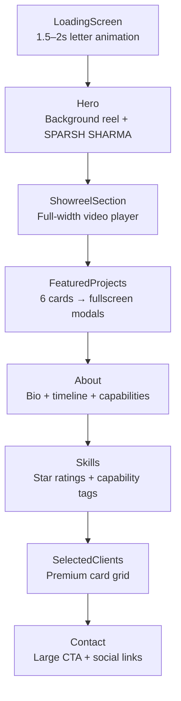
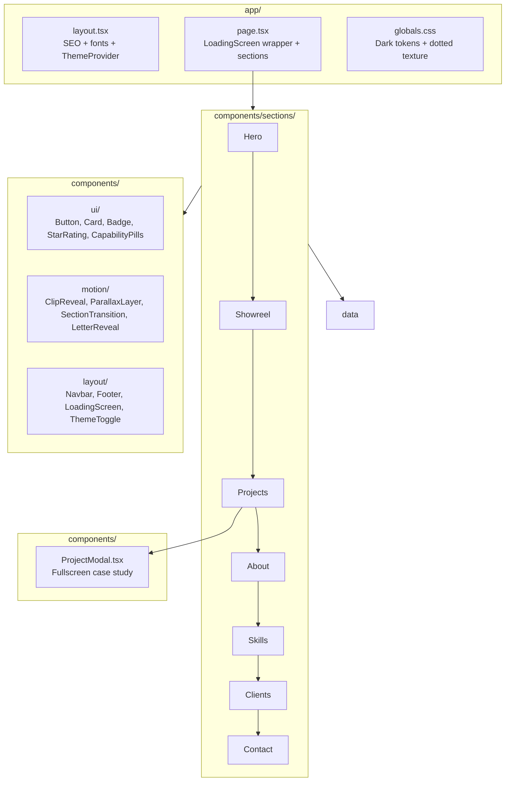

# Motion Graphics Portfolio — Sparsh Sharma (Final Spec)

## IMPORTANT — Phased Implementation

**Build the website in phases. Do not attempt everything at once.** This prevents broken, half-finished output.

| Phase | Scope |
|-------|--------|
| **Phase 1** | Architecture, components, layouts, data files, responsiveness (static structure that runs) |
| **Phase 2** | Animations and interactions (Framer Motion, loading screen, modals, parallax) |
| **Phase 3** | Populate media (real URLs from Pexels, Unsplash, Pixabay, Coverr, Mixkit) |
| **Phase 4** | Run `npm install` → `npm run lint` → `npm run build` — fix all errors until zero |
| **Phase 5** | Polish spacing, typography, and responsive behavior |

**Workflow after V1:** Build → Review → Improve → Review → Polish. Further refinement happens on the live UI, not the document.

**Implementation location:** [`c:\Users\visha\OneDrive\Desktop\Sparsh`](c:\Users\visha\OneDrive\Desktop\Sparsh) (workspace root — do not skip files, do not simplify architecture).

---

## Video-First Media Rule

Sparsh is a **motion designer**. Motion designers sell motion.

**Use video wherever possible.**

When a decision must be made between **image** and **video** → **prefer video**.

Apply this to: hero background, project cards (hover preview), showreel section, about section accents, modal case studies, and any decorative media slot.

---

## Critical Build Instructions

**DO NOT create a template-looking portfolio.**

Every section must have a **distinct layout**. Avoid repeating identical card structures. The website should feel **handcrafted and editorial** — not a stack of uniform blocks.

- Use **asymmetrical layouts**, overlapping elements, large typography, and cinematic spacing
- Reference tier: **Buck**, **Ordinary Folk**, **Giant Ant**, **Active Theory**, **Tendril**
- Never default to the same fade-up animation on every section — assign a unique reveal per section (see Step 2b)

---

## Cursor Implementation Directives

These three rules are mandatory during implementation.

### 1. Generate Real Files — No Pseudocode

**IMPORTANT:**

Do not generate pseudocode. Create **actual production-ready files** with complete implementations.

Whenever creating a component:
- Create the file
- Export the component
- Import it wherever needed
- Wire everything together

Do **not** leave TODO comments. Do **not** leave placeholder implementations.

The website must run immediately after `npm install` and `npm run dev`.

### 2. Auto-Select Media — No Empty Placeholders

When selecting media:

Search and choose royalty-free media automatically from:
- Pexels
- Unsplash
- Pixabay
- Coverr
- Mixkit

Do **not** ask for images. Do **not** leave empty placeholders like "Replace with image here".

Populate **all sections** with high-quality media automatically.

Prefer: cinematic motion graphics, animation studios, 3D design, creative workspaces, abstract motion visuals, and product launch videos.

**When choosing between image and video for any slot, choose video.** Images are fallback only where video is impractical (e.g., Open Graph meta image).

Store all URLs in [`lib/data/media.ts`](lib/data/media.ts) with working direct links.

### 3. Build Completion — Iterate Until Zero Errors

After implementation, run:

```bash
npm install
npm run lint
npm run build
```

Fix all TypeScript errors. Fix all ESLint errors. Fix all image domain issues. Fix all Framer Motion issues.

**Continue iterating until the build succeeds with zero errors.**

---

## Design Philosophy

This portfolio is for a **Motion Graphics Designer**. The website must feel **cinematic and animation-focused**.

- **Prioritize video content over static imagery** — recruiters should see motion within seconds of landing.
- **Every section should include subtle motion** — fade, scale, parallax, hover depth.
- Design should feel comparable to portfolios featured on **Awwwards**, **Behance Featured**, **Dribbble**, **Locomotive**, and **Active Theory**.
- **Avoid generic agency templates.** Create an immersive storytelling experience.

---

## Context

The workspace at [`c:\Users\visha\OneDrive\Desktop\Sparsh`](c:\Users\visha\OneDrive\Desktop\Sparsh) is empty. Build from scratch: Next.js 15 App Router, TypeScript, Tailwind CSS, Framer Motion, Lucide React.

**Designer identity:** Sparsh Sharma — Motion Graphics & Story Teller, Bengaluru-based.

---

## Section Order (Video-First)

Recruiters hiring motion designers want to see motion immediately — not a biography first.



**Removed from v1:**
- Testimonials section (fake quotes are easy to spot)
- Skill progress bars (outdated)
- Brand marquee (feels 2021)

---

## Architecture Overview



---

## Step 1 — Project Scaffold

Run `create-next-app` in workspace root:

- TypeScript, Tailwind CSS, ESLint, App Router, no `src/` dir
- Install: `framer-motion`, `lucide-react`, `clsx`, `tailwind-merge`

| File | Purpose |
|------|---------|
| [`next.config.ts`](next.config.ts) | `images.remotePatterns` for Unsplash, Pexels, Pixabay |
| [`tailwind.config.ts`](tailwind.config.ts) | Dark tokens, fonts, keyframes, dotted-bg utility |
| [`app/globals.css`](app/globals.css) | CSS variables for dark/light themes, dotted texture, smooth scroll |
| [`lib/utils.ts`](lib/utils.ts) | `cn()` helper |

**Fonts (Google Fonts via `next/font`):**
- Display: **Syne** (800) — stacked hero name, section titles
- Body: **DM Sans** (400/500) — editorial body copy

---

## Step 2 — Design System (Dark-First)

Motion portfolios look best in dark mode. **Dark is the default;** optional light toggle via `ThemeProvider`.

**Dark palette:**
- Background: `#090909`
- Surface: `#111111`
- Elevated cards: `#181818`
- Dot grid: subtle `#2A2A2A` dots on `#090909`
- Text primary: `#FAFAFA` · Text muted: `#A3A3A3`

**Accent colors (electric, cinematic):**
- Electric blue: `#3B82F6`
- Purple: `#A855F7`
- Orange: `#F97316`

Accents used sparingly — gradient CTAs, hover glows, floating shapes, stat highlights.

**Light mode (toggle):** white `#FAFAFA` bg, light gray dot grid, charcoal text — same accent colors.

**Typography scale (hero — Awwwards/Linear/Stripe level):**
```
SPARSH          ← text-7xl md:text-9xl lg:text-[12rem] leading-[0.85]
SHARMA          ← same scale, stacked
Crafting motion that
turns products into stories.   ← text-xl md:text-2xl text-muted
```

Section titles: `text-4xl md:text-6xl`. Cards: `rounded-3xl`, subtle border `border-white/5`, glow on hover.

**Reusable UI** in [`components/ui/`](components/ui/):
- `Button.tsx` — primary gradient (blue→purple), ghost, play-icon variant for showreel
- `SectionHeader.tsx` — eyebrow + large title
- `Badge.tsx` — tool/capability tags
- `Card.tsx` — elevated dark card wrapper
- `StarRating.tsx` — animated star fill on scroll (5-star display, no percentages)
- `CapabilityPills.tsx` — hero focus-area tags with stagger fade-in (replaces fictional stat counters)

**Motion primitives** in [`components/motion/`](components/motion/):
- `FadeUp.tsx` — viewport fade + translateY (use sparingly, not on every section)
- `FloatingShape.tsx` — infinite float + parallax
- `ScrollReveal.tsx` — stagger children
- `LetterReveal.tsx` — per-letter stagger for loading screen and hero
- `ClipReveal.tsx` — clip-path wipe reveals (`inset`, `polygon`) for cinematic section entrances
- `ParallaxLayer.tsx` — scroll-linked Y-offset for depth layers
- `SectionTransition.tsx` — wrapper assigning per-section reveal variant via prop

**Layout** in [`components/layout/`](components/layout/):
- `LoadingScreen.tsx` — premium intro (see Step 3)
- `ThemeToggle.tsx` — sun/moon icon, persists to `localStorage`
- `Navbar.tsx` — fixed blur nav, anchor links
- `Footer.tsx` — minimal credits

---

## Step 3 — Premium Loading Experience

[`components/layout/LoadingScreen.tsx`](components/layout/LoadingScreen.tsx)

Motion designers live and die by first impressions. This runs once per session.

**Behavior:**
1. Fullscreen overlay `#090909`, z-index above all content
2. Display **SPARSH SHARMA** — each letter animates in sequentially (Framer Motion stagger, ~50ms per letter)
3. Subtle progress line or pulse beneath name
4. After **1.5–2 seconds**, entire overlay fades out + scales slightly (opacity 0, scale 1.02)
5. Main site reveals underneath with a soft fade-in
6. Skip instantly if `prefers-reduced-motion` or `sessionStorage` flag already set
7. Managed via `useState` in [`components/PortfolioShell.tsx`](components/PortfolioShell.tsx)

---

## Step 2b — Cinematic Section Transitions

**Problem to avoid:** Cursor defaulting to identical `fade up` on every section.

Use **Framer Motion transition layers**. Each section reveals through a **different cinematic transition** — mixed, not repetitive.

| Section | Reveal type | Implementation |
|---------|-------------|----------------|
| Hero | Staggered letter + scale | `LetterReveal` on name; capability pills fade in with delay |
| Showreel | Clip-path wipe | `ClipReveal` — horizontal inset wipe left→right |
| Projects | Scale + stagger | Cards scale 0.9→1 with staggered delay per card |
| About | Slide + parallax | Image parallax scroll; text slides in from opposite side |
| Skills | Fade + star fill | Tags fade; stars animate fill sequentially |
| Clients | Scale stagger grid | Cards pop in with spring physics, offset grid |
| Contact | Clip-path + fade | Bottom-up clip reveal on headline |

**Rules:**
- Wrap each section in `SectionTransition` with a unique `variant` prop
- Mix: **fade · scale · clip-path reveals · parallax · staggered text**
- Never use the same animation on consecutive sections
- `prefers-reduced-motion`: collapse all to simple opacity fade

---

## Step 4 — Content & Data Layer

All copy in [`lib/data/`](lib/data/) — no lorem ipsum, no fake testimonials.

### Hero capability tags — [`lib/data/capabilities.ts`](lib/data/capabilities.ts)

**Do not use fictional metrics** (50+ Projects, 12M+ Views, etc.) until real numbers are provided.

Instead, display four focus-area tags beneath the hero CTAs:

| Tag |
|-----|
| Motion Graphics |
| 3D Design |
| Brand Storytelling |
| Visual Direction |

Rendered as editorial pills via `CapabilityPills` — stagger fade-in on hero entrance. Real metrics can replace these later without layout changes.

### Skills — star ratings (NOT progress bars)

[`lib/data/skills.ts`](lib/data/skills.ts):

| Tool | Rating |
|------|--------|
| After Effects | ★★★★★ |
| Premiere Pro | ★★★★★ |
| Blender | ★★★★★ |
| Cinema 4D | ★★★★☆ |
| Photoshop | ★★★★★ |
| Illustrator | ★★★★☆ |
| Figma | ★★★★☆ |

**Plus capability tags** (no percentages):
- Motion Design · 3D Animation · Brand Films · Product Launches · Explainers · Social Content

### Selected Clients (replaces testimonials + marquee)

[`lib/data/clients.ts`](lib/data/clients.ts) — premium card grid, not scrolling marquee:

NovaPay · Aura · FlowStack · Zenith · Brew & Co. · Pixel Labs · Design Week

Each card: client name, project type worked on, year — inside `rounded-2xl` elevated cards.

### Projects with full case-study data

[`lib/data/projects.ts`](lib/data/projects.ts) — 6 projects, each with **modal-ready fields**:

| # | Title | Client |
|---|-------|--------|
| 1 | Brand Launch Animation | NovaPay Fintech |
| 2 | Product Commercial | Aura Skincare |
| 3 | SaaS Explainer Video | FlowStack |
| 4 | Event Promo Video | Bengaluru Design Week |
| 5 | Social Media Campaign | Brew & Co. Coffee |
| 6 | 3D Motion Design Project | Zenith Audio |

**Per-project modal fields:**
- `slug`, `title`, `client`, `role`, `year`
- `summary` — 2–3 sentence overview
- `description` — full case study narrative
- `tools[]`
- `heroImage`, `heroVideo` (Mixkit/Coverr URL)
- `gallery[]` — 2–3 stills
- `process[]` — 3–4 steps (Brief → Storyboard → Animation → Delivery)
- `results[]` — measurable outcomes (e.g., "2.4M views in 30 days", "40% increase in sign-ups")
- `accentColor` — per-project accent for modal theming

---

## Step 5 — Media Strategy

[`lib/data/media.ts`](lib/data/media.ts) — all external URLs, swappable later. **Must contain real working URLs** — no empty strings or placeholder paths.

**Auto-selection required:** During implementation, search Pexels, Unsplash, Pixabay, Coverr, and Mixkit and populate every image and video slot before marking complete.

**Video-first:**
- **Hero background reel:** muted autoplay loop `<video>` full-bleed behind hero typography, dark gradient overlay (`from-black/80 via-black/60 to-black/90`) — same reel URL reused or separate B-roll clip from Mixkit/Coverr
- Showreel section: primary featured reel — autoplay muted loop
- Each project modal: embedded `<video>` with poster frame
- Project card thumbnails: video preview on hover (muted loop)

**Images:** Unsplash/Pexels for about section, process stills, gallery — `next/image` lazy loaded, `priority` only on hero poster.

---

## Step 6 — Section Implementation

> **Layout rule:** No two sections share the same grid/card pattern. Each section below specifies its unique editorial layout.

### 1. Hero — [`components/sections/HeroSection.tsx`](components/sections/HeroSection.tsx)

Full viewport. Cinematic — motion playing behind the name.

**Layer stack (bottom → top):**
1. **Background reel** — `<video autoPlay muted loop playsInline>` full-bleed, object-cover
2. **Dark overlay** — gradient + subtle vignette so type stays readable
3. **Content** — typography, CTAs, capability tags

```
[ muted motion reel playing behind everything ]

SPARSH
SHARMA

Crafting motion that
turns products into stories.

[ ▶ PLAY SHOWREEL ]     [ VIEW WORK ]

Motion Graphics · 3D Design · Brand Storytelling · Visual Direction
```

- Massive stacked typography (`text-[12rem]` on desktop), white on dark overlay
- Primary CTA: **"Play Showreel"** → smooth-scrolls to `#showreel`
- Secondary: "View Work" → `#projects`
- **Capability pills** row (not fictional stat counters) — stagger fade-in
- 2–3 floating gradient orbs (blue/purple/orange) with mouse parallax over the video
- **Transition:** staggered letter reveal on name (not fade-up)

### 2. Showreel — [`components/sections/ShowreelSection.tsx`](components/sections/ShowreelSection.tsx)

**Immediately below hero.** This is the money section.

- Full-width 16:9 video player, `rounded-3xl`, cinematic letterbox feel
- Custom play/pause overlay with animated ring
- Video autoplays muted; click to unmute with volume icon
- Subtle glow border using accent gradient
- `id="showreel"` anchor
- **Transition:** clip-path horizontal wipe reveal

### 3. Featured Projects — [`components/sections/ProjectsSection.tsx`](components/sections/ProjectsSection.tsx)

**Layout:** Behance-style **alternating editorial grid** — odd projects large image-left, even image-right; varying card heights (not uniform grid).

- 6 large showcase cards with distinct aspect ratios per row
- Each card: video thumbnail (hover = play loop), title, client, role
- **Click opens fullscreen modal** — not inline expansion
- **Transition:** scale 0.9→1 stagger per card (spring)
- `id="projects"` anchor

### 4. Project Modal — [`components/ProjectModal.tsx`](components/ProjectModal.tsx)

Fullscreen overlay case study. Premium, immersive.

**Structure (scrollable within modal):**
1. **Hero** — full-width video or image, project title + client overlay
2. **Overview** — role, year, tools, summary
3. **Case Study** — full description narrative
4. **Videos** — embedded project reel / gallery clips
5. **Process** — 4-step timeline (Brief → Storyboard → Animation → Delivery) with icons
6. **Results** — metric cards (views, engagement, conversions)
7. **Close** — X button top-right + Escape key + click backdrop

**Motion:** modal enters scale 0.95→1 + fade; content sections fade-up on scroll inside modal; exit animation on close.

State: `selectedProject` slug in `ProjectsSection` or lifted to `PortfolioShell.tsx`.

### 5. About — [`components/sections/AboutSection.tsx`](components/sections/AboutSection.tsx)

Now placed **after** projects — bio is for people already hooked.

**Layout:** Asymmetric split — large image overlapping section boundary (negative margin), bio text offset to the right; timeline as vertical rail (not a card grid).

- Overlapping workspace image + bio column
- Experience timeline (4 entries) as editorial vertical rail
- Creative capability cards in a **2×2 offset grid** (not identical to project cards)
- **Transition:** parallax on image + slide-in text from opposite side
- `id="about"` anchor

### 6. Skills — [`components/sections/SkillsSection.tsx`](components/sections/SkillsSection.tsx)

**Layout:** Two-column split — star ratings left, capability tag cloud right (not a single uniform grid).

**No progress bars.** Two sub-sections:

**A. Tools — star ratings list:**
```
AFTER EFFECTS  ★★★★★
BLENDER        ★★★★★
CINEMA 4D      ★★★★☆
```
Stars animate fill on scroll into view.

**B. Capabilities — scattered pill tags** (editorial, not uniform card grid):
Motion Design · 3D Animation · Brand Films · Product Launches · Explainers · Social Content

- **Transition:** sequential star fill + tag fade stagger

### 7. Selected Clients — [`components/sections/ClientsSection.tsx`](components/sections/ClientsSection.tsx)

**Layout:** Masonry-style offset grid — cards at varying vertical offsets, not a flat uniform grid.

- Section title: **"Selected Clients"** or **"Worked With"**
- Responsive grid (2 col mobile → 4 col desktop) with staggered Y offsets
- Each client in premium card: name, project type, year
- Subtle hover lift + border glow (accent color)
- **Transition:** spring scale stagger per card
- `id="clients"` anchor

### 8. Contact — [`components/sections/ContactSection.tsx`](components/sections/ContactSection.tsx)

**Layout:** Full-bleed centered typographic statement — oversized headline dominates, social links in a horizontal row below (not a form card).

- Large headline: "Let's create something unforgettable."
- Email: `hello@sparshsharma.com`
- Social: LinkedIn, Instagram, Behance (Lucide icons)
- Magnetic hover on buttons
- **Transition:** bottom-up clip-path reveal on headline
- `id="contact"` anchor

### Navbar — [`components/layout/Navbar.tsx`](components/layout/Navbar.tsx)

Links: Work · Showreel · About · Contact + theme toggle + "Let's Talk" CTA

---

## Step 7 — Page Assembly & SEO

**[`app/layout.tsx`](app/layout.tsx):**
- Metadata: title, description, Open Graph, Twitter card, keywords
- `ThemeProvider` wrapper (class-based dark/light on `<html>`)
- Font variables

**[`app/page.tsx`](app/page.tsx):**
```
LoadingScreen → Navbar → Hero → Showreel → Projects → About → Skills → Clients → Contact → Footer
```

**Performance:**
- Lazy load below-fold images
- `prefers-reduced-motion`: skip loading screen animation, disable float/parallax
- Showreel video: `preload="metadata"`; project card videos: `preload="none"` until hover
- Project modal videos: load on open

---

## Step 8 — Responsive & Polish

See **Responsive Design Requirements** below for full breakpoint specs (Desktop / Laptop / Tablet / Mobile). Build **mobile-first** — the mobile experience must not be a compressed desktop layout.

Quick rules:
- Body scroll locked when project modal open
- Focus-visible rings on all interactive elements
- Use Tailwind breakpoints: `sm` (640px), `md` (768px), `lg` (1024px), `xl` (1280px), `2xl` (1440px)

---

## Final Folder Structure

```
Sparsh/
├── app/
│   ├── layout.tsx
│   ├── page.tsx
│   └── globals.css
├── components/
│   ├── PortfolioShell.tsx       ← client wrapper: loading + modal state
│   ├── ProjectModal.tsx         ← fullscreen case study
│   ├── layout/
│   │   ├── Navbar.tsx
│   │   ├── Footer.tsx
│   │   ├── LoadingScreen.tsx
│   │   └── ThemeToggle.tsx
│   ├── motion/
│   │   ├── FadeUp.tsx
│   │   ├── FloatingShape.tsx
│   │   ├── ScrollReveal.tsx
│   │   ├── LetterReveal.tsx
│   │   ├── ClipReveal.tsx
│   │   ├── ParallaxLayer.tsx
│   │   └── SectionTransition.tsx
│   ├── sections/
│   │   ├── HeroSection.tsx
│   │   ├── ShowreelSection.tsx
│   │   ├── ProjectsSection.tsx
│   │   ├── AboutSection.tsx
│   │   ├── SkillsSection.tsx
│   │   ├── ClientsSection.tsx
│   │   └── ContactSection.tsx
│   └── ui/
│       ├── Button.tsx
│       ├── Badge.tsx
│       ├── Card.tsx
│       ├── SectionHeader.tsx
│       ├── StarRating.tsx
│       └── CapabilityPills.tsx
├── lib/
│   ├── hooks/
│   │   ├── useMediaQuery.ts
│   │   └── usePrefersReducedMotion.ts
│   ├── data/
│   │   ├── content.ts
│   │   ├── projects.ts
│   │   ├── capabilities.ts
│   │   ├── clients.ts
│   │   ├── skills.ts
│   │   └── media.ts
│   ├── utils.ts
│   └── ThemeProvider.tsx
├── public/
├── next.config.ts
├── tailwind.config.ts
├── postcss.config.mjs
├── tsconfig.json
├── package.json
└── .gitignore
```

**Estimated file count:** ~35 files

---

## Responsive Design Requirements

**Critical:** Design four distinct experiences — Desktop, Laptop, Tablet, Mobile. Do **not** simply shrink the desktop layout. Most AI-generated portfolios fail here.

Build **mobile-first**, then enhance at each breakpoint.

### Breakpoint Map

| Tier | Range | Tailwind |
|------|-------|----------|
| Mobile | 320px–767px | base → `md` |
| Tablet | 768px–1023px | `md` → `lg` |
| Laptop | 1024px–1439px | `lg` → `2xl` |
| Desktop | 1440px+ | `2xl`+ |

---

### Desktop Experience (1440px+)

Cinematic and immersive. Maximum polish.

```
┌─────────────────────────────────────┐
│                                     │
│   SPARSH                            │
│   SHARMA                            │
│                                     │
│   Crafting motion that turns        │
│   products into stories             │
│                                     │
│   [Showreel] [Projects]             │
│                                     │
└─────────────────────────────────────┘
```

**Requirements:**
- Full-width layouts with max content width **1400px–1600px** (`max-w-[1600px] mx-auto`)
- Large editorial typography (`text-[12rem]` hero)
- Multi-column grids (3–4 columns where applicable)
- Floating decorative elements + mouse parallax
- Hover animations on cards and buttons
- Video backgrounds (hero reel)
- Project cards in **alternating editorial layouts**
- Large spacing and breathing room (`py-32`, generous gaps)

---

### Laptop Experience (1024px–1440px)

Premium feel with reduced visual density.

| Desktop | Laptop |
|---------|--------|
| 3–4 columns | 2–3 columns |
| `text-[12rem]` hero | Slightly reduced hero type |
| Full parallax | Floating objects scaled down |
| Alternating project layout | 2-column editorial project layout |

**Requirements:**
- Modal remains fullscreen
- Navigation stays horizontal
- Preserve cinematic feel — do not strip motion or video

---

### Tablet Experience (768px–1024px)

```
Desktop Grid          Tablet Grid
[ A ][ B ][ C ]  →    [ A ][ B ]
                      [ C ][ D ]
```

**Requirements:**
- Switch to **2-column layouts**
- Reduce oversized typography (hero → `text-7xl`–`text-8xl`)
- Reduce parallax intensity (lower offset multipliers)
- Hide non-essential decorative floating elements
- Maintain all section reveal animations
- Showreel remains prominent and full-width

---

### Mobile Experience (320px–768px)

**Must NOT be a compressed desktop site.** Design mobile-first.

**Hero layout:**
```
SPARSH
SHARMA

Crafting motion
that turns products
into stories.

[Showreel]

Motion Graphics · 3D Design
Brand Storytelling · Visual Direction
```

**Requirements:**
- Single-column layout throughout
- Hero text: **`text-4xl`–`text-6xl`** (not desktop scale)
- Capability pills wrap to 2×2 grid on small screens
- Stack all sections vertically
- Remove excessive floating decorations
- **Disable heavy parallax** (set parallax offset to 0 or remove listeners)
- Optimize videos for mobile (`playsInline`, lower preload, poster frames)
- Touch-friendly interactions — **minimum 44px tap targets**
- Faster/shorter animation durations (reduce stagger delays ~30%)
- Simplified project card layouts (stacked, not alternating)

---

### Mobile Navigation

**Desktop:** horizontal links — Work · Showreel · About · Contact

**Mobile (`< lg`):**
```
☰  →  ┌─────────────┐
        │ Work        │
        │ Showreel    │
        │ Projects    │
        │ About       │
        │ Contact     │
        └─────────────┘
```

**Requirements:**
- Animated slide-down menu (Framer Motion height/opacity)
- Backdrop blur overlay
- Full-width touch targets (min 44px height per link)
- Close menu on link click + Escape key
- Body scroll locked while menu open

Implement in [`components/layout/Navbar.tsx`](components/layout/Navbar.tsx) with `useMediaQuery` or Tailwind `lg:hidden` / `hidden lg:flex`.

---

### Responsive Project Cards

**Desktop — alternating editorial:**
```
┌──────────────┬──────────────┐
│              │              │
│  Project     │ Details      │
│              │              │
└──────────────┴──────────────┘
```

**Mobile — stacked:**
```
┌──────────────┐
│              │
│   Project    │
│              │
└──────────────┘
   Details Below
```

| Breakpoint | Layout |
|------------|--------|
| Desktop (1440px+) | Alternating image-left / image-right editorial |
| Laptop (1024–1440px) | 2-column editorial grid |
| Tablet (768–1024px) | 2-column grid |
| Mobile (<768px) | Stacked cards, details below image |

**Interaction:**
- Desktop/laptop: hover effects (video preview, meta slide-up)
- Touch devices: convert hover to **tap** — use `@media (hover: hover)` or pointer detection; tap to preview, second tap or button to open modal

---

### Responsive Project Modal

| Desktop | Mobile |
|---------|--------|
| Fullscreen case study overlay | Slide-up drawer **or** fullscreen mobile sheet |

**Requirements:**
- **100vh** height on all devices
- Sticky close button (top-right, min 44px, always visible)
- Swipe-friendly scrolling inside modal
- Optimized video playback (`playsInline`, load video on modal open only)
- Touch gestures supported (scroll, no conflicting swipe-to-close unless intentional)
- On mobile: consider bottom sheet entrance animation (translateY from 100%)

Implement in [`components/ProjectModal.tsx`](components/ProjectModal.tsx) with responsive layout variants.

---

### Performance Requirements

**Mobile Lighthouse targets:**

| Category | Target |
|----------|--------|
| Performance | 90+ |
| Accessibility | 95+ |
| Best Practices | 95+ |
| SEO | 95+ |

**Requirements:**
- Lazy load images (`next/image` with `loading="lazy"`, explicit dimensions)
- Lazy load videos (`preload="none"` until in viewport or modal open)
- Use `next/image` for all static images
- Optimize animations — transform/opacity only (GPU-friendly), no layout-triggering properties
- Respect `prefers-reduced-motion`
- **No layout shifts** — reserve space for images/videos with aspect-ratio boxes
- Maintain **60fps scrolling** — avoid heavy scroll listeners; throttle parallax

**Utility:** Add [`lib/hooks/useMediaQuery.ts`](lib/hooks/useMediaQuery.ts) and [`lib/hooks/usePrefersReducedMotion.ts`](lib/hooks/usePrefersReducedMotion.ts) for conditional motion/parallax.

---

## Verification Checklist

1. Loading screen plays once (1.5–2s), letters animate, fades into site
2. Hero has **muted background reel** playing behind SPARSH / SHARMA with dark overlay
3. Hero shows "Play Showreel" as primary CTA + **capability pills** (no fictional metrics)
4. Showreel video is the second section, plays on load
5. Clicking a project card opens fullscreen modal with case study, videos, process, results
6. **Each section uses a different reveal animation** — no repeated fade-up pattern
7. **Each section has a distinct layout** — asymmetric, editorial, no identical card grids
8. Skills show star ratings — no percentage bars anywhere
9. No testimonials — clients shown in offset grid cards
10. Dark mode default; theme toggle works
11. Reduced-motion respected throughout
12. **All media populated** — no empty image/video placeholders anywhere
13. **Desktop (1440px+):** full cinematic layout, parallax, alternating projects, max-width 1600px
14. **Laptop (1024–1440px):** 2–3 columns, reduced hero type, horizontal nav preserved
15. **Tablet (768–1024px):** 2-column grids, reduced parallax, decorative elements hidden
16. **Mobile (320–768px):** single-column, `text-4xl`–`text-6xl` hero, no heavy parallax, 44px tap targets, animated hamburger menu
17. Project cards: alternating (desktop) → 2-col (tablet/laptop) → stacked (mobile)
18. Project modal: fullscreen desktop, slide-up sheet on mobile, sticky close button
19. Touch devices: hover converted to tap interactions
20. Mobile Lighthouse: Performance 90+, Accessibility 95+, Best Practices 95+, SEO 95+
21. `npm run lint` and `npm run build` pass with **zero errors**
22. Site runs immediately after `npm install && npm run dev`

---

## v1 → v2 → v3 Change Summary

| Area | v1 | v2 | v3 |
|------|----|----|-----|
| Section order | Hero → About → Projects | Hero → Showreel → Projects → About… | Same as v2 |
| Hero | Standard name | Massive type + stats | **+ Background reel video + dark overlay** |
| Animations | Basic fade-up everywhere | Subtle motion per section | **Unique cinematic transition per section** (clip-path, scale, parallax, stagger) |
| Layout | Uniform card grids | Editorial cards | **Explicit anti-template rule — distinct layout per section** |
| Skills | Progress bars | Star ratings | Same as v2 |
| Testimonials | Fake quotes | Removed | Same as v2 |
| Projects | Hover cards | Fullscreen modal | Same as v2 + varying card heights |
| Theme | Light default | Dark-first | Same as v2 |
| Loading | None | Letter animation | Same as v2 |
| Design brief | Technical | Cinematic philosophy | **+ DO NOT template + Buck/Active Theory refs** |
| Responsive | Single "mobile-first" note | — | **Four-tier specs: Desktop / Laptop / Tablet / Mobile + Lighthouse targets** |
| Hero metrics | Fictional 50+/12M+ counters | — | **Capability pills: Motion Graphics, 3D Design, Brand Storytelling, Visual Direction** |
| Cursor directives | — | — | **Real files only · auto media · lint/build until zero errors** |
| Build process | Single pass | — | **5-phase implementation · video over image · V1→Review→Polish workflow** |

---

## Build Readiness

**Status: Ready for development.** Do not refine this document further.

Expected quality curve:
- First build (V1): ~80–85%
- After 2–3 refinement prompts: ~90–95%
- After manual polish: 95%+

**To start:** Read the entire specification. Create the project exactly as described. **Start with Phase 1 only.** Do not skip files. Do not simplify the architecture. Begin implementation.
